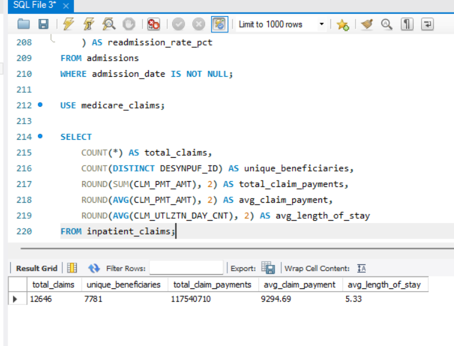
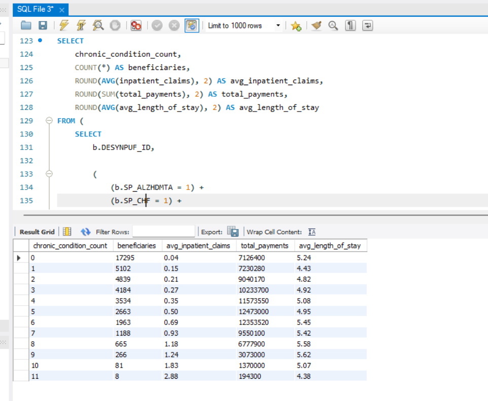
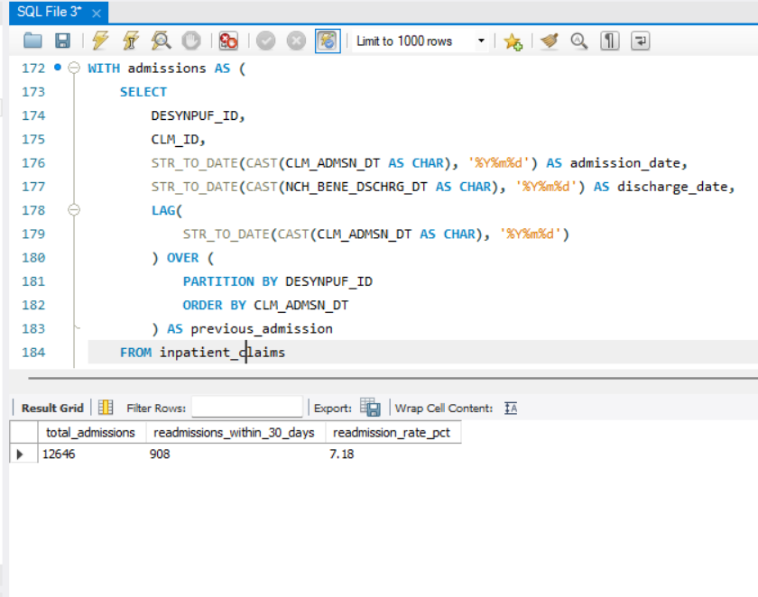
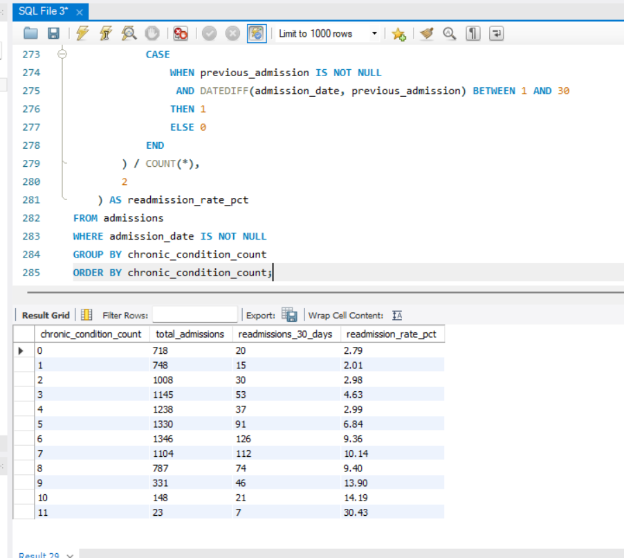
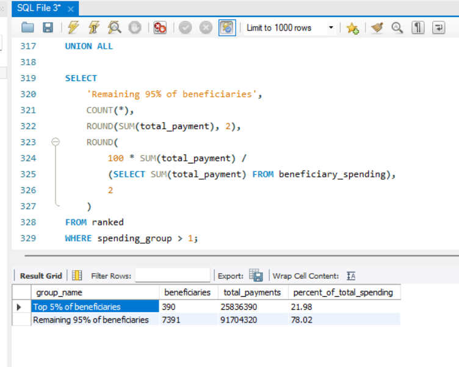
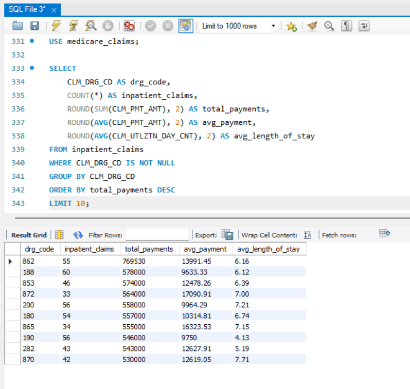

# Medicare Inpatient Claims Analysis

## Overview

SQL-based healthcare analytics project analyzing synthetic Medicare inpatient claims data to examine inpatient utilization, chronic-condition burden, 30-day readmissions, and healthcare spending.

## Business Questions

- What does overall inpatient utilization look like?
- How does chronic-condition burden relate to inpatient utilization?
- What is the overall 30-day readmission rate?
- Does readmission rate change as chronic-condition burden increases?
- How concentrated are inpatient payments among beneficiaries?
- Which DRG groups account for the greatest inpatient spending?

## Data

**Source:** Centers for Medicare & Medicaid Services (CMS) DE-SynPUF

**Data:**
- 2008 Beneficiary Summary File — Sample 1
- 2008–2010 Inpatient Claims File — Sample 1

The dataset is synthetic and does not represent actual Medicare beneficiaries. Findings should not be interpreted as estimates of real-world Medicare utilization or outcomes.

## Tools

- MySQL
- MySQL Workbench
- SQL
- Common Table Expressions (CTEs)
- Window Functions
- CASE Statements
- Aggregate Functions

## Analysis

### 1. Baseline Inpatient Utilization

The dataset contained:

- **12,646 inpatient claims**
- **7,781 unique beneficiaries**
- **$117.5M in inpatient claim payments**
- **$9,294.69 average claim payment**
- **5.33 days average length of stay**



### 2. Chronic-Condition Burden

I calculated the number of chronic-condition indicators associated with each beneficiary and compared condition burden with inpatient utilization.

Average inpatient claims increased from **0.04 claims per beneficiary among beneficiaries with 0 chronic-condition indicators** to **2.88 claims among beneficiaries with all 11 indicators**.



### 3. 30-Day Readmissions

The overall 30-day readmission rate was **7.18%**.

There were **908 readmissions within 30 days among 12,646 inpatient admissions**.



### 4. Readmissions and Chronic-Condition Burden

Readmission rates generally increased as chronic-condition burden increased.

The rate reached **14.19% among beneficiaries with 10 chronic-condition indicators** and **30.43% among beneficiaries with all 11 indicators**.

These highest-burden groups were small, so the results should be interpreted cautiously.



### 5. Cost Concentration

The top 5% of beneficiaries by inpatient spending accounted for **21.98% of total inpatient payments**.



### 6. Top DRG Spending

The analysis identified the top 10 DRG groups by total inpatient payments.



## Key Takeaways

- Higher chronic-condition burden was associated with greater inpatient utilization.
- The overall 30-day readmission rate was 7.18% in this synthetic sample.
- Readmission rates generally increased among higher chronic-condition burden groups.
- The top 5% of beneficiaries accounted for 21.98% of inpatient payments.
- DRG-level analysis identified the inpatient groups associated with the greatest total spending.

## Limitations

- The dataset is synthetic and has no inferential value for actual Medicare beneficiaries.
- The analysis uses a limited sample rather than the complete Medicare population.
- Chronic-condition indicators represent conditions included in the source dataset and should not be interpreted as comprehensive clinical diagnoses.
- Readmission analysis is based on available admission dates and does not attempt to reproduce a formal CMS quality-measure methodology.

## Repository Structure

```text
sql/
├── 01_data_validation.sql
├── 02_baseline_metrics.sql
├── 03_chronic_condition_analysis.sql
├── 04_readmission_analysis.sql
├── 05_cost_concentration.sql
└── 06_top_drg_spending.sql

screenshots/
├── 01_baseline_metrics.png
├── 02_chronic_condition_analysis.png
├── 03_readmission_analysis.png
├── 04_readmission_by_condition.png
├── 05_cost_concentration.png
└── 06_top_drg_spending.png
